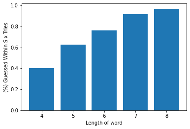

# AIHangman

This was an Hangman Bot I created from scratch for my Intro to AI class. It can guess a word you give it within 6-8 guesses on average.
Many of the functions are created using with basic concepts learned in the class, such as constraining your domain.
The main reason for using python is the ease of string manipulation and list comprehension for constraining the word list.

Here are the results:

This was done by sampling 1000 words from the words file and tested pass/fail given 6 guesses, as expected in a normal game of hangman.
The extra files portion has some more details.

It's fully modular, so new functions/methods could easily be added and changed.

## Usage

The two hangman python files, HangmanV2/HangmanV3 are user-friendly and should provide prompts for a word.

If you want to vary the number of tries/guesses the bot has, edit the tries_left variable within main.

Version 3 will require a separate input file of words as explained below.
  Here's the one I used on [dwyl's github](https://github.com/dwyl/english-words).

## V2 vs. V3

The difference was that version 2 uses the NLTK corpus of words, whereas version 3 reads a json of words.
This was done to see the difference between word databases. Changing the database is fairly straight-forward.

## Extra files

Included in this repo are a testingstuff.ipynb where I did most of my brainstorming and a getstats.py file where I experimented with different multiprocessing features and ran several tests to come up with the given figure.

## Further Development

The weakness of my code currently is in attempting to guess the first letter of a word. Without any of the functions to constrain the word any further, we are reliant solely on nextGuess() function, which is determining letters based on the probability of the word alone. Another potential solution would be to implement a neural network to give further data on frequently chosen letters and words, so that more information would be known to make a better first guess. The code is also entirely static, that is, a word will always be guessed in the same fashion, so a word that the program loses will continue to lose to it. Along with adding a neural network, we could take the probabilities one step further by creating a nash equilibrium. By taking the probabilities calculated in nextGuess(), the values could be stored, so the user couldn’t pick just a single word and always expect to win. Another flaw is in guessing four-letter words. Because it is so hard to guess four-letter words in general, it would reason to add special code to handle the case of four-letter words and create a specific algorithm for it, such as taking a random monte-carlo approach for example to give guessing a more variety and consequently be able to guess complex words in a better manner.
